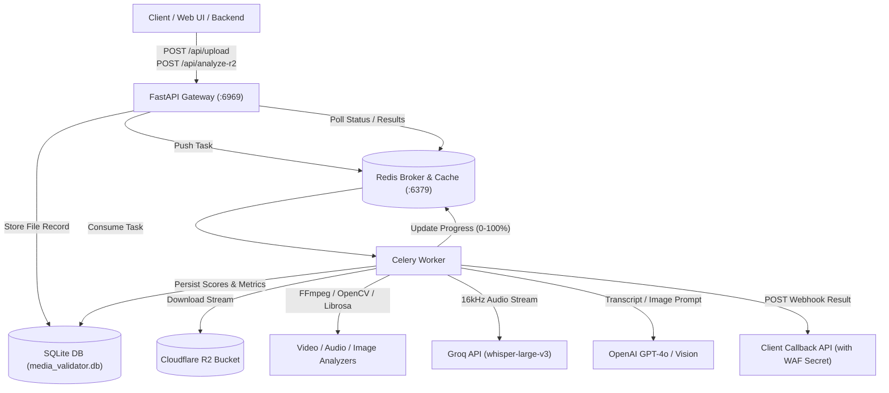

# AI Media Quality Validator (VideoTester)

Deep AI-powered media quality and compliance validation system for social media content (videos, audio, and static images). Evaluates technical fidelity, audio dynamics, aesthetic composition, and brand mentions using computer vision, signal processing, and cloud AI APIs.

---

## 🌟 Key Features

- **Multi-Modal Content Analysis**:
  - **Video Analysis**: Resolution, framerate, bitrate, codec, perceptual visual quality (BRISQUE algorithm with Laplacian fallback), dark scene blocking artifacts, and temporal stability tracking.
  - **Audio Analysis**: Signal-to-Noise Ratio (SNR), integrated loudness (LUFS via ITU-R BS.1770 / EBU R128), sample-level clipping detection, speech clarity (spectral centroid + formant ratio), and three-band frequency balance.
  - **Image Analysis**: Sharpness, resolution, aspect ratio, brightness, plus GPT-4o Vision for content categorization, OCR, aesthetic vibrancy, composition quality, and brand logo detection (visibility, placement, prominence).
- **Automated Cloud Speech & Brand Compliance**:
  - High-speed audio transcription powered by **Groq API** (`whisper-large-v3`).
  - LLM-assisted phonetic transcript correction and entity extraction via **OpenAI GPT-4o** (tailored for Hinglish, Indian pop culture entities, and colloquial phonetics).
  - Exact and fuzzy timestamped brand mention tracking (`rapidfuzz`).
- **Distributed Asynchronous Processing**:
  - **Celery + Redis** task queue for decoupling file ingestion and resource-intensive media processing.
  - Real-time task progress and status tracking cached in Redis (with 1-hour TTL).
  - Parallelized Groq transcription running concurrently alongside CPU-bound video and audio pipelines.
- **Cloudflare R2 Direct Integration**:
  - Download and analyze media directly from pre-signed or public R2 URLs without pre-saving to user storage.
- **Automated Webhook Callbacks**:
  - Emits webhook notifications to client backends upon analysis completion, including campaign/creator metadata and custom `X-Callback-Secret` headers for AWS WAF whitelisting.
- **Modern Responsive Dashboard**:
  - Dark-mode web interface with real-time SVG animated score gauge, audio/video metric meters, interactive transcript viewer with highlighted brand tags, and historical upload records.

---

## 🏗️ System Architecture



---

## ⚙️ Environment Variables & Configuration

Create a `.env` file in the project root or in `backend/.env`:

| Variable | Description | Required | Default / Example |
| :--- | :--- | :---: | :--- |
| `GROQ_API_KEY` | API key for Groq audio transcription (`whisper-large-v3`) | **Yes** | `gsk_...` |
| `OPENAI_API_KEY` | API key for GPT-4o transcript restoration and GPT-4o Vision | Optional* | `sk-proj-...` (*Required for Vision/Restoration) |
| `REDIS_URL` | Redis connection URL for Celery broker & status caching | Optional | `redis://localhost:6379/0` (or `redis://redis:6379/0` in Docker) |
| `PORT` | API server listening port | Optional | `6969` |
| `HOST` | API server host binding | Optional | `0.0.0.0` |
| `BACKEND_BASE_URL` | Base URL used to construct the default analysis callback URL | Optional | `http://127.0.0.1:8080` |
| `CALLBACK_SECRET` | Secret token included in `X-Callback-Secret` header on webhooks | Optional | `your_secret_waf_token` |

---

## 🚀 Quick Start

### 1. Local Development (Native Python)

#### Prerequisites
- **Python 3.10+** (Tested with Python 3.11 & 3.13)
- **FFmpeg & FFprobe** installed and accessible in system `PATH`
- **Redis server** running locally on port 6379

#### Installation
```bash
# Clone the repository
git clone https://github.com/your-org/videotester.git
cd videotester

# Set up backend virtual environment
cd backend
python -m venv venv
source venv/bin/activate  # On Windows: venv\Scripts\activate

# Install dependencies
pip install -r requirements.txt
```

#### Run Services
**Terminal 1: Start Redis**
```bash
redis-server
```

**Terminal 2: Start Celery Worker**
```bash
cd backend
python -m celery -A worker.celery worker --loglevel=info --pool=solo
```

**Terminal 3: Start FastAPI Server**
```bash
cd backend
python -m uvicorn main:app --reload --host 0.0.0.0 --port 6969
```

Open `http://localhost:6969` in your web browser.

---

### 2. Docker Compose (Recommended)

#### Development Environment (Hot-Reload Enabled)
Mounts local directories for instant live reloads:
```bash
docker compose -f docker-compose.dev.yml up -d --build
docker compose -f docker-compose.dev.yml logs -f
```

#### Production Environment
Runs optimized containers with memory leak limits and single-concurrency isolation:
```bash
docker compose up -d --build
docker compose logs -f
```

For advanced container options and AWS EC2 Graviton deployment, see [docker-commands.md](file:///e:/Projects/work/videotester/docker-commands.md).

---

## 📊 Scoring Models

### Video Scoring Formula
$$\text{Video Score} = 0.50 \times \text{Visual Quality (BRISQUE)} + 0.30 \times \text{Bitrate Score} + 0.20 \times \text{Resolution Score}$$
- **Resolution Score**: Evaluated against standard resolutions (4K: 100, 1080p: 85, 720p: 70, 480p: 50, 360p: 30).
- **Bitrate Score**: Evaluated against streaming targets (≥10 Mbps: 100, ≥5 Mbps: 80, ≥2.5 Mbps: 60, ≥1 Mbps: 40).
- **Temporal Stability**: Calculated from frame-to-frame standard deviations and quality drops; tracked separately without penalizing overall score.

### Audio Scoring Formula
$$\text{Audio Score} = 0.30 \times \text{SNR Score} + 0.40 \times \text{Speech Clarity Score} + 0.30 \times \text{Clipping Score}$$
- **Penalties**: 10% penalty if integrated loudness is excessively quiet (< -30 LUFS) or excessively loud (> -8 LUFS).

### Image Scoring Formula
$$\text{Image Score} = 0.40 \times \text{Technical} + 0.30 \times \text{Aesthetic} + 0.30 \times \text{Brand}$$
- **Technical (40%)**: $0.40 \times \text{Resolution} + 0.60 \times \text{Laplacian Sharpness}$.
- **Aesthetic (30%)**: $0.50 \times \text{GPT Vibrancy} + 0.50 \times \text{GPT Composition}$.
- **Brand (30%)**: Logo visibility score (None: 0, Low: 30, Med: 70, High: 100, +20 if prominent). Automatically forced to `0` if a target brand is specified but absent.

---

## 📚 Project Documentation

Detailed guides located in [`docs/`](file:///e:/Projects/work/videotester/docs/):
- [Local Setup & Development Guide (docs/SETUP_GUIDE.md)](file:///e:/Projects/work/videotester/docs/SETUP_GUIDE.md) — Step-by-step setup for Windows/Mac/Linux, FFmpeg install, Celery `--pool=solo`, and troubleshooting.
- [API Reference (docs/API.md)](file:///e:/Projects/work/videotester/docs/API.md) — Comprehensive guide to endpoints, payloads, polling, R2 integration, and webhooks.
- [Architecture Deep Dive (docs/ARCHITECTURE.md)](file:///e:/Projects/work/videotester/docs/ARCHITECTURE.md) — Worker lifecycle, queue concurrency, memory management, and database schema.
- [Docker & EC2 Deployment Guide (docs/docker-commands.md)](file:///e:/Projects/work/videotester/docs/docker-commands.md) — Container commands, ARM64 build script, and EC2 instructions.


